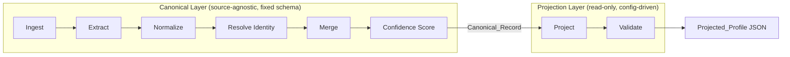
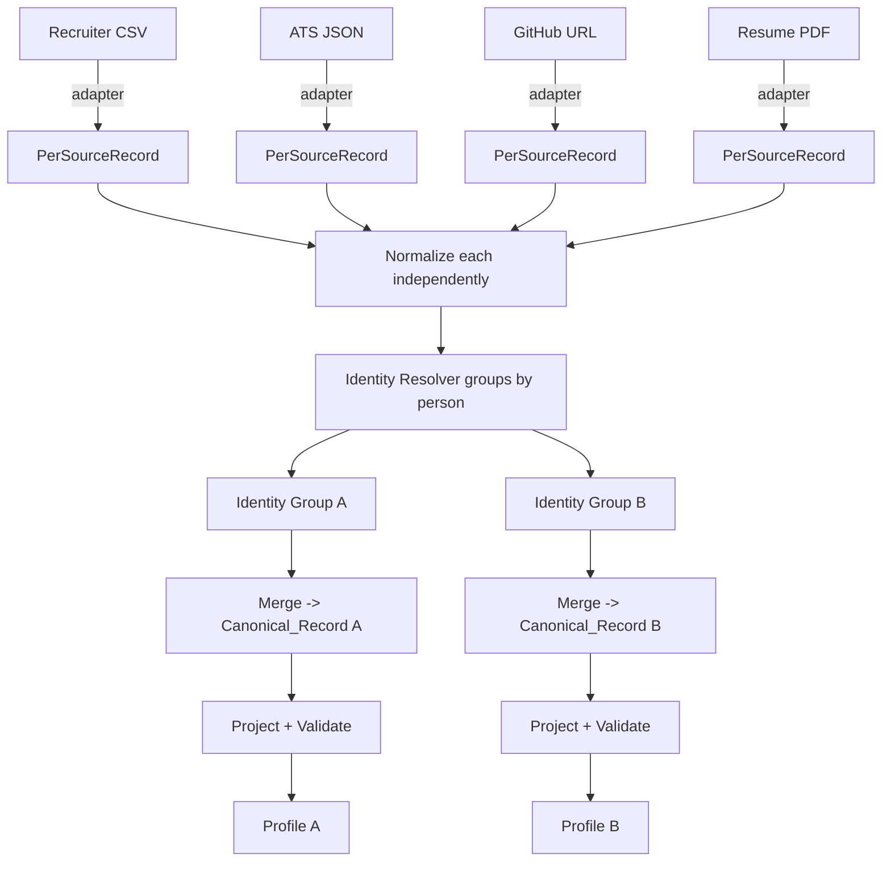
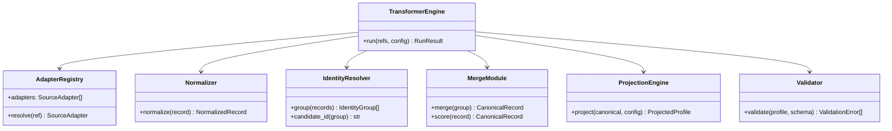
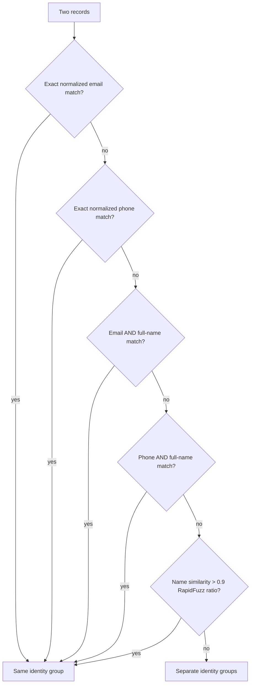
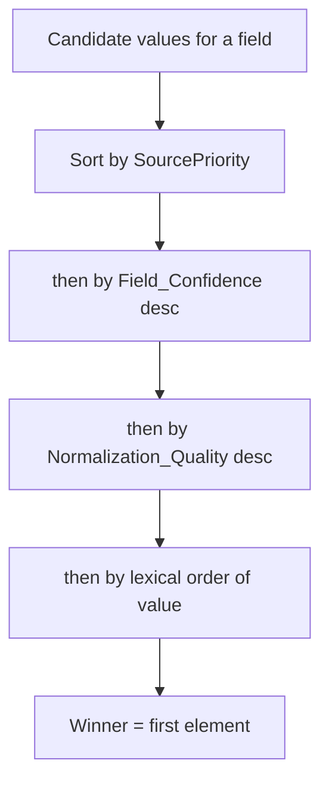

# Design Document: Multi-Source Candidate Data Transformer

## Overview

The Multi-Source Candidate Data Transformer is a deterministic, explainable pipeline that turns
heterogeneous candidate inputs (Recruiter CSV, ATS JSON, GitHub, LinkedIn, Resume, Recruiter notes)
into a single canonical candidate profile, then projects that profile into any caller-specified
output schema at runtime.

The design is organized around three hard separations that make the whole assignment tractable:

1. **Adapters vs. engine.** Every source is read through a uniform `SourceAdapter` interface that
   emits a `PerSourceRecord`. The pipeline core knows nothing about CSV parsing, PDF extraction, or
   URL scraping — only about `PerSourceRecord`s. New sources are pluggable. (Req 1, 2)
2. **Canonical record vs. projection.** The internal `Canonical_Record` has a single fixed schema.
   The `Projection_Module` is a *read-only* transformation that never mutates the canonical record,
   so one canonical record can safely drive many projections. (Req 8, 15)
3. **Engine vs. CLI.** All logic lives in a library with no I/O coupling. The CLI is a thin shell
   that wires file paths and a config into the engine and serializes the result. (Req 13)

The guiding principle from the requirements drives every design decision: **a wrong-but-confident
value is worse than an honestly-empty one.** When a value cannot be determined, the system records
`null` plus a provenance entry explaining "not found" — it never invents data. (Req 2.6, 17.2)

### Design Priorities (in order)

1. **Determinism** — identical inputs + config produce byte-identical output. No wall-clock, no
   randomness, no hash-map iteration order leaks into output. (Req 12, 16)
2. **Robustness** — no input (missing, empty, garbage binary, malformed JSON) may crash the run.
   Errors are captured as structured `Error_Report`s and the run continues. (Req 10, 18)
3. **Explainability** — every value carries provenance and confidence. (Req 6, 7, 17)
4. **Configurability** — output shape is data, not code. (Req 8)
5. **Scale** — per-candidate isolation enables streaming/batch processing. (Req 14, 19)

## Architecture

### Pipeline Stages

The pipeline is a linear sequence of pure-ish stages. Each stage has a typed input and output and is
independently testable. The clean boundary between the canonical layer (stages 1–6) and the
projection layer (stages 7–8) is the core of Requirement 15.



| # | Stage | Module | Input | Output | Requirements |
|---|-------|--------|-------|--------|--------------|
| 1 | Ingest | `Ingestion_Module` | Source references | `RawSource[]` | 1, 10.1 |
| 2 | Extract | `Extraction_Module` | `RawSource` | `PerSourceRecord` | 2, 10.2, 10.3 |
| 3 | Normalize | `Normalization_Module` | `PerSourceRecord` | normalized `PerSourceRecord` + quality scores | 3 |
| 4 | Resolve Identity | `Identity_Resolver` | `PerSourceRecord[]` | identity groups + `candidate_id` | 4 |
| 5 | Merge | `Merge_Module` | one identity group | `Canonical_Record` (values + provenance) | 5, 6 |
| 6 | Confidence Score | `Merge_Module` | `Canonical_Record` | `Canonical_Record` (+ confidences) | 7 |
| 7 | Project | `Projection_Module` | `Canonical_Record` + `Projection_Config` | `Projected_Profile` | 8, 15 |
| 8 | Validate | `Validation_Module` | `Projected_Profile` + schema | validated profile or errors | 9 |

### Data Flow



A run produces **one `Projected_Profile` per identity group** (Req 14.1). Each identity group is
processed end-to-end independently, so a failure in one candidate produces an `Error_Report` for
that candidate only and never affects others (Req 14.3, 14.4).

### Per-Candidate Isolation & Scale

Identity resolution is the only stage that must observe records across candidates. After grouping,
every group is an independent unit of work:

- Groups are processed one at a time (or in a bounded worker pool), so peak memory is proportional to
  the largest single candidate's source set, not the whole batch (Req 14.2, 19).
- Streaming: ingestion yields records lazily where the source format allows (CSV rows, JSON arrays).
  For identity resolution, only the lightweight identity keys (emails, phones, normalized name) need
  to be held in memory; full source payloads can be re-read per group.
- A failure thrown while processing one group is caught at the group boundary, converted to an
  `Error_Report`, and the loop continues (Req 14.4).

## Components and Interfaces

### Common Source Adapter Interface

Every source type implements one interface. This is what makes sources pluggable (Req 1, 2.3).

```python
class SourceAdapter(Protocol):
    source_type: str          # e.g. "recruiter_csv", "ats_json", "github", ...
    reliability: float        # Source_Reliability weight (Req 7.3)
    priority: int             # SourcePriority rank (lower = more authoritative)

    def can_handle(self, ref: SourceRef) -> bool:
        """True if this adapter recognizes the reference (extension, URL host, ...)."""

    def ingest(self, ref: SourceRef) -> RawSource:
        """Load raw bytes/text. Raises only IngestError, caught by the runner."""

    def extract(self, raw: RawSource) -> list[PerSourceRecord]:
        """Parse raw content into one or more per-source records.
        Structured sources may yield many (one per CSV row); unstructured yield one.
        Missing fields are set to null; never invents values (Req 2.4, 2.6)."""
```

Adapters are registered in a fixed-order registry. The registry order is deterministic and also
encodes default `SourcePriority`.

#### Structured Source Adapters

- **`RecruiterCsvAdapter`** (Req 1.3): reads CSV with header `name, email, phone, current_company,
  title`. Each row becomes one `PerSourceRecord`. Maps `current_company` -> latest
  `experience[].company`, `title` -> `headline`/`experience[].title`.
- **`AtsJsonAdapter`** (Req 1.4, 2.3): reads JSON whose field names differ from canonical
  (e.g. `candidateName`, `emailAddress`, `phoneNumber`, `yrsExp`). A declarative field-mapping table
  translates ATS keys to canonical paths.

#### Unstructured Source Adapters

- **`GithubAdapter`** (Req 1.5): given a public profile URL, extracts username, name, bio
  (-> `headline`), location, repo languages (-> candidate `skills`), and the profile link.
- **`LinkedinAdapter`** (Req 1.6): given a public profile URL, extracts name, headline, location,
  experience, education, skills, and the profile link.
- **`ResumeAdapter`** (Req 1.7): given a PDF/DOCX, extracts text then applies section/regex
  extractors for contact info, experience, education, and a skills section.
- **`RecruiterNotesAdapter`** (Req 1.8): given a plain-text notes file, applies lightweight regex
  extraction for emails, phones, names, and mentioned skills.

Each adapter records the **extraction method** used per value (e.g. `"csv_column"`,
`"regex_email"`, `"pdf_section_skills"`) for provenance (Req 2.5).

### Module Responsibilities



### Normalization (Req 3)

Each normalizer is a pure function returning `(value | None, normalization_quality)`:

| Field | Canonical format | Quality scoring | Null rule |
|-------|------------------|-----------------|-----------|
| phone | E.164 (`+14155552671`) | 1.0 if region-confident parse; ~0.7 if region assumed | non-parseable -> null (3.2) |
| date | `YYYY-MM` | 1.0 if month+year present; ~0.6 if only year (assume `-01`) | non-parseable -> null (3.4) |
| country | ISO-3166 alpha-2 | 1.0 exact code/name match; ~0.7 fuzzy/alias | unresolvable -> null (3.6) |
| skill | `Canonical_Skill_Name` | 1.0 exact canonical; ~0.8 alias match | not in vocabulary -> null (3.8) |
| email | lowercased, trimmed | 1.0 if valid syntax; ~0.7 otherwise | (always best-effort) (3.9) |

`Normalization_Quality` feeds the confidence formula (Req 3.10, 7.2).

### Identity Resolution (Req 4)

The resolver applies the **`Identity_Match_Priority`** rules in fixed order, stopping at the first
satisfied rule (Req 4.2, 4.5):



Grouping uses union-find over records so the relation is transitive and order-independent. To keep
grouping deterministic regardless of input order, records are sorted by a stable key before pairwise
evaluation.

**Deterministic `candidate_id`** (Req 4.6, 4.7, 4.8): each group has a *normalized identity key*
chosen deterministically — the lexicographically smallest normalized email if any email exists,
else the smallest normalized phone, else a normalized-name key. The id is
`UUID5(NAMESPACE_CANDIDATE, identity_key)` (a SHA-1-based, content-derived, stable UUID). Same
content -> same key -> same id, with no wall-clock or randomness.

### Merge & Conflict Resolution (Req 5)

For each **single-valued** canonical field, the `Merge_Module` collects all candidate values across
the group's sources and selects a winner via the **`Winner_Selection_Policy`**, applied as an
ordered comparator (Req 5.3):

1. **SourcePriority** — prefer the more authoritative source type (Req 5.4).
2. **Field_Confidence** — higher confidence wins.
3. **Normalization_Quality** — cleaner conversion wins.
4. **Stable lexical ordering** of the candidate value's string form — final deterministic
   tie-break (Req 5.5).



**SourcePriority table** (highest -> lowest authority): Recruiter CSV, ATS JSON, Resume, LinkedIn,
GitHub, Recruiter notes.

**Source_Reliability table**: Recruiter CSV 0.95, ATS JSON 0.90, Resume 0.85, LinkedIn 0.80,
GitHub 0.70, Recruiter notes 0.60 (Req 7.3).

For **list-valued** fields (emails, phones, skills, links.other), values from all sources are
combined and **deduplicated**, with a deterministic sort applied for stable ordering (Req 5.6, 12.2).
Each contributing value keeps its own provenance entry (Req 6.4).

### Confidence Model (Req 7)

**`Confidence_Formula`** (Req 7.2), applied per field and clamped to `[0,1]`:

```
Field_Confidence = clamp(0.5 * Source_Reliability
                       + 0.3 * Agreement_Score
                       + 0.2 * Normalization_Quality, 0.0, 1.0)
```

**`Agreement_Score`** (Req 7.4):

```
Agreement_Score = (# sources supplying the winning value) / (# sources containing the field)
                = 0.0   when no source contains the field   (avoids divide-by-zero)
```

Because more agreeing sources raises `Agreement_Score`, multi-source agreement yields confidence
greater than or equal to single-source confidence, satisfying Req 7.5.

**Null fields** get `Field_Confidence = 0.0` (Req 7.7).

**`Overall_Confidence`** (Req 7.6) is the mean of the `Field_Confidence` values of the non-null
canonical fields (0.0 if all fields are null). This is deterministic given deterministic field
confidences (Req 7.8).

### Projection Engine (Req 8)

The `Projection_Config` is interpreted at runtime by a path-resolution engine. It reads from the
canonical record and writes to a fresh output object — it **never mutates the canonical record**
(Req 8.2, 15).

Supported config capabilities:

| Capability | Config form | Behavior | Req |
|------------|-------------|----------|-----|
| Field selection | list of field entries | only listed fields appear | 8.3 |
| Rename / remap | `{ "name": "out", "from": "canonical.path" }` | read `from`, write under `name` | 8.4, 8.8 |
| Nested path | `from: "location.city"` | resolve into nested structure | 8.5 |
| Indexed array | `from: "phones[0]"` | element at index | 8.6 |
| Array projection | `from: "skills[].name"` | list of subfield from each element | 8.7 |
| Per-field normalization | `normalize: "uppercase"` | apply transform to value | 8.10 |
| Provenance toggle | `include_provenance: false` | omit provenance | 8.11 |
| Confidence toggle | `include_confidence: false` | omit confidences | 8.12 |
| `on_missing: null` | per field | emit null when absent | 8.13 |
| `on_missing: omit` | per field | drop field when absent | 8.14 |
| `on_missing: error` | required field | report projection error | 8.15 |
| Invalid path | bad index/subfield | report projection error | 8.16 |

**Canonical path grammar** (used by `from`):

```
path     := segment ('.' segment)*
segment  := name | name '[' index ']' | name '[]' ('.' name)?
```

Path resolution distinguishes three failure modes:
- **Field absent from canonical record** -> apply `on_missing` (null / omit / error).
- **Out-of-range index** (`phones[50]`) -> projection error identifying the path (Req 8.16).
- **Non-existent subfield** (`skills[].abc`) -> projection error identifying the path (Req 8.16).

**Example `Projection_Config`** (the shape used in the assignment):

```json
{
  "include_provenance": false,
  "include_confidence": true,
  "fields": [
    { "name": "id",            "from": "candidate_id",       "type": "string",  "required": true,  "on_missing": "error" },
    { "name": "name",          "from": "full_name",          "type": "string",  "required": true,  "on_missing": "null" },
    { "name": "primary_email", "from": "emails[0]",          "type": "string",  "on_missing": "null" },
    { "name": "country",       "from": "location.country",   "type": "string",  "enum": ["US","IN","GB"], "on_missing": "omit" },
    { "name": "skills",        "from": "skills[].name",      "type": "array",   "element_type": "string", "on_missing": "null" },
    { "name": "experience",    "from": "experience",         "type": "array",
      "element_type": { "company": "string", "title": "string", "start": "string", "end": "string" } },
    { "name": "linkedin",      "from": "links.linkedin",     "type": "string",  "normalize": "lowercase", "on_missing": "omit" }
  ]
}
```

### Output Schema Validation (Req 9)

After projection, the `Validation_Module` validates the `Projected_Profile` against the schema
declared inline in the `Projection_Config` field entries:

- **type** check — value matches declared scalar/array/object type (9.3).
- **required** check — field present (9.4).
- **enum** check — value is a member of the declared set (9.5).
- **array** check — value is a list and each element matches `element_type` (9.6).
- **object** check — value contains declared subfields with declared types (9.7).

Each failure produces a structured validation error naming the field and reason (Req 9.2). Validation
is decoupled from projection so projection errors and validation errors are reported distinctly.

### CLI Surface (Req 13)

A thin wrapper over `TransformerEngine.run(...)`:

```
candidate-transform \
    --input recruiter.csv --input ats.json --input resume.pdf \
    --config projection.json \
    [--output profiles.json]
```

- One or more `--input` references and one `--config` (Req 13.1).
- `--output PATH` writes JSON to file; absence prints JSON to stdout (Req 13.2, 13.3).
- Missing required input -> usage error naming the missing argument (Req 13.4).
- Unparseable config -> configuration error naming the problem (Req 13.5).
- Clean run -> exit 0 (Req 13.6); any source/projection error -> non-zero exit and the
  `Error_Report` entries are printed to stderr (Req 13.7).

The CLI contains no business logic; all behavior is in the engine library so it can be embedded.

## Data Models

### Canonical Record (Canonical_Schema)

```jsonc
{
  "candidate_id": "uuid5-string",
  "full_name": "string | null",
  "emails": ["string"],
  "phones": ["string (E.164)"],
  "location": { "city": "string | null", "region": "string | null", "country": "string | null (ISO-3166 a2)" },
  "links": {
    "linkedin": "string | null",
    "github": "string | null",
    "portfolio": "string | null",
    "other": ["string"]
  },
  "headline": "string | null",
  "years_experience": "number | null",
  "skills": [ { "name": "Canonical_Skill_Name", "confidence": 0.0, "sources": ["source_id"] } ],
  "experience": [ { "company": "string|null", "title": "string|null", "start": "YYYY-MM|null", "end": "YYYY-MM|null", "summary": "string|null" } ],
  "education": [ { "institution": "string|null", "degree": "string|null", "field": "string|null", "end_year": "number|null" } ],
  "provenance": [ { "field": "string", "value": "any|null", "source": "source_id|null", "method": "string|null", "confidence": 0.0 } ],
  "overall_confidence": 0.0
}
```

### Per-Source Record

```jsonc
{
  "source_id": "string",          // unique reference to the originating artifact
  "source_type": "recruiter_csv | ats_json | github | linkedin | resume | recruiter_notes",
  "values": { /* canonical field name -> { value, method, normalization_quality } */ },
  "errors": [ /* Error_Report */ ]
}
```

### Error Report & Log Entry

```jsonc
// Error_Report (Req 10, 11)
{ "source": "source_id | null", "stage": "ingest|extract|normalize|resolve|merge|project|validate", "error": "human-readable description" }

// Log_Entry (Req 11.3)
{ "timestamp": "ISO-8601", "level": "INFO|WARNING|ERROR", "module": "string", "message": "string" }
```

Note: `timestamp` in logs is operational metadata and is intentionally **not** part of the canonical
output, preserving determinism of the `Projected_Profile` (Req 12.1).

### Run Result

```jsonc
{
  "profiles": [ /* Projected_Profile per identity group */ ],
  "errors":   [ /* Error_Report[] */ ],
  "exit_code": 0
}
```

## Correctness Properties

*A property is a characteristic or behavior that should hold true across all valid executions of a
system — essentially, a formal statement about what the system should do. Properties serve as the
bridge between human-readable specifications and machine-verifiable correctness guarantees.*

These properties are written for property-based testing: each is universally quantified and traces
back to the requirements it validates. They are deliberately consolidated to remove redundancy
(e.g. the several determinism criteria collapse into one end-to-end determinism property).

### Property 1: End-to-end determinism

*For any* set of source contents and *any* `Projection_Config`, running the full pipeline twice —
including with the input sources supplied in a different order — produces byte-identical
`Projected_Profile` output, identical list-valued field ordering, and identical provenance ordering.

**Validates: Requirements 7.8, 12.1, 12.2, 12.3, 16.1**

### Property 2: Robustness — never crashes on garbage

*For any* input — including missing references, empty files, random bytes, malformed JSON/CSV, and
truncated documents — the run completes without raising, returns a `RunResult`, and reports a
structured `Error_Report` (with `{source, stage, error}`) for each source that failed.

**Validates: Requirements 10.1, 10.2, 10.3, 10.4, 10.5, 11.1, 11.2, 18.1**

### Property 3: Projection isolation (no mutation)

*For any* `Canonical_Record` and *any* (one or more) `Projection_Config`s, projecting leaves the
canonical record deep-equal to its pre-projection state, and applying multiple configs produces each
`Projected_Profile` from the same unchanged canonical record.

**Validates: Requirements 8.2, 15.1, 15.2, 15.3**

### Property 4: Confidence formula correctness

*For any* `Source_Reliability`, `Agreement_Score`, and `Normalization_Quality` each in `[0,1]`, the
computed `Field_Confidence` equals `clamp(0.5*reliability + 0.3*agreement + 0.2*quality, 0, 1)`, and
the `Agreement_Score` equals (sources supplying the winning value) / (sources containing the field),
or `0.0` when no source contains the field.

**Validates: Requirements 7.2, 7.4**

### Property 5: Confidence bounds and null-honesty of confidence

*For any* assembled `Canonical_Record`, every `Field_Confidence` and the `Overall_Confidence` lie in
`[0,1]`, every `Normalization_Quality` lies in `[0,1]`, and every field whose value is `null` has a
`Field_Confidence` of exactly `0.0`.

**Validates: Requirements 3.10, 7.1, 7.6, 7.7**

### Property 6: Agreement monotonicity

*For any* field, the `Field_Confidence` computed when N sources agree on the winning value is greater
than or equal to the `Field_Confidence` computed when only one source provides that value (all else
equal).

**Validates: Requirements 7.5**

### Property 7: Normalization yields canonical format or null

*For any* input string, each normalizer returns either `null` or a value in its canonical format:
phones match E.164, dates match `YYYY-MM`, countries are valid ISO-3166 alpha-2 codes, and skills are
members of the `Controlled_Skill_Vocabulary`. A non-convertible value always yields `null` and never
an invented or partially-formatted value.

**Validates: Requirements 3.1, 3.2, 3.3, 3.4, 3.5, 3.6, 3.7, 3.8**

### Property 8: Email normalization is idempotent

*For any* email string, normalization produces a trimmed, lowercased value, and normalizing an
already-normalized email returns the same value (`normalize(normalize(e)) == normalize(e)`).

**Validates: Requirements 3.9**

### Property 9: Identity grouping is order-independent and consistent

*For any* set of per-source records, grouping is independent of input order, and any two records that
share a normalized email (or satisfy any earlier rule in `Identity_Match_Priority`) are assigned to
the same identity group; records satisfying no rule are placed in separate groups.

**Validates: Requirements 4.1, 4.2, 4.3, 4.4, 4.5**

### Property 10: candidate_id is deterministic and idempotent

*For any* identity group, the derived `candidate_id` is a pure function of the group's normalized
identity key — identical across repeated computation and across input reorderings, and equal when the
same source content is processed again.

**Validates: Requirements 4.6, 4.7, 4.8**

### Property 11: Winner selection follows the policy deterministically

*For any* set of conflicting candidate values for a single-valued field, the selected winner is the
first value under the ordering (SourcePriority, then Field_Confidence, then Normalization_Quality,
then stable lexical order), and the result is independent of the order in which candidate values are
presented.

**Validates: Requirements 5.2, 5.3, 5.4, 5.5**

### Property 12: List-valued fields are deduplicated

*For any* identity group, each list-valued field (emails, phones, skills, links.other) in the
resulting `Canonical_Record` contains no duplicate values.

**Validates: Requirements 5.6**

### Property 13: Provenance completeness and null explanation

*For any* `Canonical_Record`, every field has at least one matching provenance entry of shape
`{field, value, source, method, confidence}`; each contributing value of a list-valued field has its
own entry; and every field whose value is `null` has a provenance entry with `value = null` and
`source`/`method` indicating the value was not found.

**Validates: Requirements 6.1, 6.2, 6.3, 6.4, 17.1, 17.2**

### Property 14: Projection path resolution is correct

*For any* `Canonical_Record` and *any* valid `Projection_Config`, the `Projected_Profile` contains
exactly the selected output field names, and each output value equals the value resolved from its
`from` canonical path (supporting nested paths, indexed elements `phones[0]`, and array projections
`skills[].name`) with any declared per-field normalization applied.

**Validates: Requirements 8.1, 8.3, 8.4, 8.5, 8.6, 8.7, 8.8, 8.10, 8.11, 8.12**

### Property 15: Missing-value and invalid-path handling

*For any* `Projection_Config` field referencing an absent canonical field, the engine applies the
configured `on_missing` behavior — `null` emits null, `omit` excludes the field, `error` reports a
projection error naming the field — and *any* invalid path (out-of-range index `phones[50]` or a
non-existent subfield `skills[].abc`) produces a projection error naming the invalid path.

**Validates: Requirements 8.9, 8.13, 8.14, 8.15, 8.16**

### Property 16: Schema validation soundness

*For any* schema and a `Projected_Profile` generated to conform to it, validation passes; and for any
single injected violation (wrong type, missing required field, out-of-enum value, non-list for an
array field, or a missing/mistyped object subfield), validation fails with an error identifying the
offending field and reason.

**Validates: Requirements 9.1, 9.2, 9.3, 9.4, 9.5, 9.6, 9.7**

### Property 17: Per-candidate batch isolation

*For any* batch of candidates, the `Projected_Profile` produced for a given candidate is identical to
the profile produced when that candidate's sources are processed alone, and a failure injected into
one candidate does not change the output of any other candidate.

**Validates: Requirements 14.1, 14.3, 14.4**

## Error Handling

Error handling is built around two structured artifacts and a never-crash discipline.

### Error_Report `{ source, stage, error }` (Req 11.1, 11.2)

Every stage wraps its risky work in a boundary that, on failure, emits an `Error_Report` tagged with
the failing `stage` and the originating `source`, then allows the run to continue:

| Failure | Stage | Behavior |
|---------|-------|----------|
| Referenced source missing | `ingest` | record error, continue with remaining sources (10.1) |
| Source empty | `extract` | produce all-null `PerSourceRecord`, continue (10.2) |
| Source malformed/unparseable | `extract` | record error, continue with remaining sources (10.3) |
| All sources fail | `merge` | produce all-null `Canonical_Record`, report each failure (10.4) |
| Candidate processing fails | per-group | record error for that candidate, continue batch (14.4) |
| Projection path invalid / required missing | `project` | record projection error naming the path/field (8.15, 8.16) |
| Output fails schema | `validate` | record validation error naming field + reason (9.2) |

The top-level runner guarantees no exception escapes: the whole run always returns a `RunResult` with
`profiles` and `errors` (Req 10.5, 18.1).

### Structured Logging `{ timestamp, level, module, message }` (Req 11.3–11.6)

- **INFO** — normal progress (source loaded, group formed, profile emitted) (11.4).
- **WARNING** — recoverable conditions: missing/empty/skipped values, fallback normalization (11.5).
- **ERROR** — emitted alongside every `Error_Report` (11.6).

Log timestamps are operational only and never enter the canonical output, preserving determinism.

### Exit Codes (Req 13.6, 13.7)

`0` on a clean run; non-zero when any source or projection error occurred, with the `Error_Report`
entries written to stderr.

## Testing Strategy

A dual approach: property-based tests for universal correctness, plus focused unit/integration tests
for concrete examples, adapters, and the CLI.

### Property-Based Testing

PBT is appropriate here because the core of the system is pure transformation logic (normalizers,
identity resolution, merge/winner selection, confidence math, projection, validation) with large
input spaces and strong universal invariants (determinism, round-trips, bounds, isolation).

- **Library**: `Hypothesis` (Python). The engine is implemented in Python so adapters can lean on
  mature libraries (see Technology Choices). Do not hand-roll a generator framework.
- **Iterations**: each property test runs a minimum of 100 generated examples.
- **Traceability**: each property test is tagged with a comment in the form
  `Feature: candidate-data-transformer, Property {number}: {property_text}` referencing the property
  above.
- **Generators**: custom strategies for `PerSourceRecord`s (with arbitrary present/absent fields and
  source types), `Canonical_Record`s, `Projection_Config`s (valid and invalid paths), schemas with
  conforming and mutated profiles, and "garbage" byte/string inputs for robustness.
- Each of the 17 correctness properties maps to exactly one property-based test.

### Unit & Integration Tests (examples, edge cases, infrastructure)

- **Per-adapter example tests** — a known CSV/JSON/PDF/DOCX/URL fixture yields the expected
  `PerSourceRecord` with correct `source_type`/`source_id` (Req 1.x, 2.5).
- **CLI tests** — invoke the CLI with/without `--output`, with a missing `--input`, and with an
  unparseable config; assert exit codes, stdout vs file output, and error messages (Req 13.x). These
  are example/integration tests, not properties.
- **Logging-level tests** — assert INFO/WARNING/ERROR emission for representative events (Req 11.4–11.6).
- **Scale/memory integration test** — one large-batch run (thousands of synthetic candidates)
  asserting completion and bounded memory (Req 14.2, 19.1). This is an integration test, not a
  property, because behavior does not vary meaningfully with input and 100 iterations add no value.

### Edge Cases Covered by Generators

The robustness, normalization, and projection generators are responsible for exercising: empty
sources, all-whitespace fields, non-ASCII/Unicode names, mixed phone formats, year-only dates,
unknown skills/aliases, and out-of-range/invalid projection paths.

## Edge Cases and Descoping

### Notable edge cases and handling

1. **Two different people, nearly identical names, no shared contact.** Name-similarity rule (>0.9)
   could over-merge. Handled by ordering identity rules so exact email/phone wins first, and by only
   falling back to name similarity when no contact identifiers exist; conservative threshold avoids
   false merges (Req 4.2). When in doubt, keep them separate (null-honesty applied to identity).
2. **Conflicting countries from a high-priority vs. high-confidence source.** Winner policy is
   explicit and ordered (SourcePriority first), so the outcome is deterministic and explainable, with
   provenance showing the losing value too (Req 5.3, 6.x).
3. **Garbage/binary file given where a PDF is expected.** Extraction boundary catches the parse
   failure, emits an `Error_Report{stage: extract}`, and the run continues with other sources
   (Req 10.3, 18.1).
4. **Projection config references `phones[0]` but the candidate has no phones.** Distinguished from an
   invalid path: absent field triggers `on_missing` (null/omit/error); out-of-range index on a
   present-but-short list is a projection error (Req 8.13–8.16).
5. **All sources for a candidate fail to parse.** A `Canonical_Record` with all-null fields is still
   produced (with `overall_confidence` 0.0) plus per-source error reports — the run never aborts
   (Req 10.4).

### Deliberately descoped under time pressure

- **Real network scraping of GitHub/LinkedIn.** Live HTML scraping and auth are brittle and
  rate-limited; adapters operate on fetched/sample profile payloads behind the same interface, so the
  scraping layer can be swapped in later without engine changes.
- **ML/NLP entity extraction from resumes.** Resume extraction uses section heuristics + regex rather
  than a trained model. The `extract` method is the only thing that would change.
- **Fuzzy skill matching beyond the controlled vocabulary + aliases.** Out-of-vocabulary skills map
  to null rather than guessing (null-honesty).
- **Persistence / database / API server.** Out of scope; the engine is a library + CLI.
- **Concurrency tuning.** Per-candidate isolation makes parallelism trivial to add later; the initial
  implementation processes groups sequentially (or with a simple bounded pool).

## Technology Choices

Chosen to maximize library leverage for the unstructured sources while keeping the engine decoupled
from the CLI.

| Concern | Choice | Rationale |
|---------|--------|-----------|
| Language | **Python 3.11+** | Best ecosystem for the messy parts (PDF/DOCX, phone/country normalization, fuzzy matching). |
| CLI | **`argparse`** (or `click`) | Thin, stdlib-friendly; engine stays import-only. |
| Property testing | **Hypothesis** | Mature PBT with shrinking; 100+ iterations per property. |
| Unit testing | **pytest** | Standard, integrates with Hypothesis. |
| Phone normalization | **`phonenumbers`** | Robust E.164 parsing (Req 3.1). |
| Country codes | **`pycountry`** | ISO-3166 alpha-2 resolution (Req 3.5). |
| Name similarity | **`rapidfuzz`** | The requirements name the RapidFuzz ratio explicitly (Req 4.2). |
| PDF/DOCX text | **`pdfplumber` / `python-docx`** | Resume text extraction (Req 1.7). |
| Deterministic IDs | **stdlib `uuid.uuid5`** | Content-derived, stable, no randomness (Req 4.7). |
| Dates | **stdlib `datetime` + light parsing** | `YYYY-MM` normalization (Req 3.3). |

The engine package exposes `TransformerEngine.run(refs, config)` and has zero dependency on the CLI;
the CLI module imports the engine. This keeps the assignment's "engine decoupled from CLI"
requirement structurally enforced.
